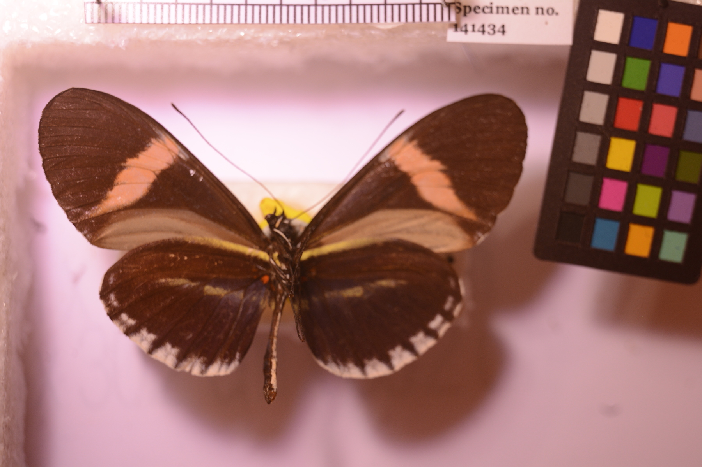
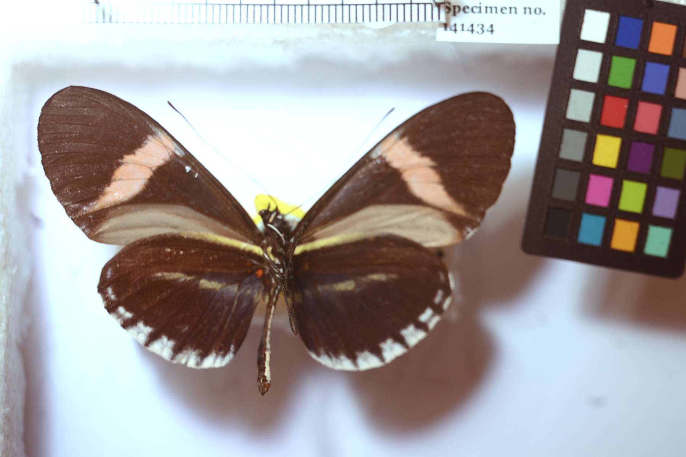

## **Tool:** Color Correction Tool Using Cropped Color Checker

Input: 
Output: 
## Introduction
- to do 
    - create a script to generate pair text file
    - one folder to contain actual full color checker
    - one folder to contain input images
    - have to rewrite code in a python file 
    - organize and make a single main file
    - have to find a way to segment boxes out of the color checker
```
python start.py
```
currently working in Trial.ipynb